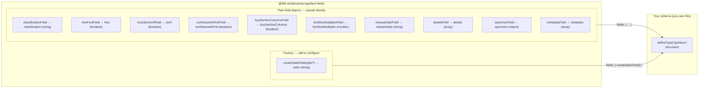

# sanity-typeface-fields

[](https://www.npmjs.com/package/@liiift-studio/sanity-typeface-fields)
[](#license)
[](https://www.sanity.io/)

Standalone Sanity field definitions for typeface documents. Import individual fields and drop them into any schema group — no opinion about document structure.

Each export is a ready-made field you spread into your own `typeface` document. There is no plugin to register and no required document shape: take only the fields you want, place them in whatever order or fieldset you like, and query the values directly with GROQ. It ships as ESM + CJS with TypeScript types and a tested state-field factory.

## How the fields fit together

The package is **field definitions only** — you own the `defineType` document; these slot into its `fields` array. Ten exports are plain field objects; one (`createStateField`) is a factory you call.



## Install

```bash
npm install @liiift-studio/sanity-typeface-fields
```

## Usage

`defineType` and `defineField` come from `sanity`. Plain field objects are spread in directly; `createStateField` is a factory, so call it.

```typescript
import { defineType, defineField } from 'sanity'
import {
	classificationField,
	createStateField,
	freeFontField,
	includesSerifField,
	sortHeaviestFirstField,
	buySectionColumnsField,
	fontSizeMultiplierField,
	releaseDateField,
	detailsField,
	specimenField,
	metadataField,
} from '@liiift-studio/sanity-typeface-fields'

export const typefaceSchema = defineType({
	name: 'typeface',
	type: 'document',
	fields: [
		defineField({ name: 'name', type: 'string', title: 'Name' }),
		classificationField,
		createStateField({
			publishedValue: 'published',
			publishedTitle: 'Published',
		}),
		freeFontField,
		includesSerifField,
		sortHeaviestFirstField,
		fontSizeMultiplierField,
		buySectionColumnsField,
		releaseDateField,
		detailsField,
		specimenField,
		metadataField,
	],
})
```

Every field is independent — import only the ones you need. Because each export is a plain field definition, you can also spread it and override locally, e.g. `{ ...classificationField, group: 'meta' }`.

## Field reference

Each export below lists the **stored field `name`** (what you query with GROQ) and its Sanity `type`. Field names are intentionally generic, so check for collisions with your existing schema before adding.

| Export | Stored `name` | Type | What it stores |
|---|---|---|---|
| `classificationField` | `classification` | `string` | Single-line classification label (e.g. "Sans Serif", "Display") |
| `createStateField(opts?)` | `state` | `string` | Publish-state selector (see below). Factory — **call it** |
| `freeFontField` | `free` | `boolean` | Typeface is free to download — alters the Buy/checkout flow. Default `false` |
| `includesSerifField` | `serif` | `boolean` | Serif flag for the serif/sans frontend filter. Default `false` |
| `sortHeaviestFirstField` | `sortHeaviestFirst` | `boolean` | Sort weights heaviest→lightest instead of the default. Default `false` |
| `buySectionColumnsField` | `buySectionColumns` | `boolean` | Multi-column vs. single-column buy section. Default `true` |
| `fontSizeMultiplierField` | `fontSizeMultiplier` | `number` | Buy-section font-size scaler. Default `1`, validated `0.5`–`2.0` |
| `releaseDateField` | `releaseDate` | `string` | Release year. Defaults to the current year |
| `detailsField` | `details` | `array` | Visual Details — close-up character images with `caption` + `style` |
| `specimenField` | `specimen` | `object` | Tester defaults: `initial_text` + up to 3 `paragraphs` |
| `metadataField` | `metadata` | `array` | Flat key/value pairs, seeded with Designer / Engineer / Current & Initial Release |

> Several fields (`buySectionColumns`, `sortHeaviestFirst`, `fontSizeMultiplier`, `free`) drive Liiift foundry-shop frontends. They are still standalone field objects — adopt or ignore them per field.

### `createStateField(options)`

Factory for the publish-state selector. Only the *published* option is configurable; the other three states are fixed.

```typescript
const stateField = createStateField({
	publishedValue: 'live',   // value stored when published — default 'published'
	publishedTitle: 'Live on site', // label shown in the Studio — default 'Published ✅'
})
```

| Option | Default | Purpose |
|---|---|---|
| `publishedValue` | `'published'` | Value stored for the published state (MCKL passes `'active'`) |
| `publishedTitle` | `'Published ✅'` | Studio label for the published option |

The generated field is `name: 'state'`, `type: 'string'`, `initialValue: 'draft'`, with `Rule.required()`. The state list always has exactly four options:

| Value | Default title |
|---|---|
| `draft` | Draft 🟡 |
| *(your `publishedValue`)* | *(your `publishedTitle`)* — default `Published ✅` |
| `hidden` | Hidden 👻 |
| `archived` | Archived 📂 |

Query it directly: `*[_type == "typeface" && state == "published"]`.

## Compatibility

- **Sanity** `>=3` (Studio v3 and v4) — declared as a peer dependency.
- Ships **ESM** (`dist/index.mjs`) and **CJS** (`dist/index.js`) with bundled **TypeScript types** (`dist/index.d.ts`).
- `sanity` is `external` in the build — your Studio's copy is used; nothing is bundled.
- No runtime dependencies of its own.

## Peer Dependencies

| Package | Version |
|---|---|
| `sanity` | `>=3` |

## Testing

The `createStateField` factory is covered by [Vitest](https://vitest.dev) (`src/fields/stateField.test.ts`).

```bash
npm test
```

## License

MIT © [Quinn Keaveney](https://liiift.studio)
