# sanity-typeface-fields

[](https://www.npmjs.com/package/@overpunch/sanity-typeface-fields)
[](#license)
[](#compatibility)

Standalone Sanity field definitions for typeface documents. Import individual fields and drop them into any schema group — no opinion about document structure.

Each export is a ready-made field you spread into your own `typeface` document. There is no plugin to register and no required document shape: take only the fields you want, place them in whatever order or fieldset you like, and query the values directly with GROQ. It ships as ESM + CJS with TypeScript types and a tested state-field factory.

## How the fields fit together

The package is **field definitions only** — you own the `defineType` document; these slot into its `fields` array. Twelve exports are plain field objects; two (`createStateField`, `createSpecimenField`) are factories you call.

```mermaid
flowchart LR
	subgraph YOUR["Your schema (you own this)"]
		DOC["defineType('typeface')\ndocument"]
	end

	subgraph PKG["@overpunch/sanity-typeface-fields"]
		direction TB
		subgraph OBJ["Plain field objects — spread directly"]
			F1["classificationField → classification (string)"]
			F2["freeFontField → free (boolean)"]
			F3["includesSerifField → serif (boolean)"]
			F4["sortHeaviestFirstField → sortHeaviestFirst (boolean)"]
			F5["buySectionColumnsField → buySectionColumns (boolean)"]
			F6["fontSizeMultiplierField → fontSizeMultiplier (number)"]
			F7["releaseDateField → releaseDate (string)"]
			F8["detailsField → details (array)"]
			F9["specimenField → specimen (object)"]
			F10["metadataField → metadata (array)"]
			F11["languagesField → languages (array)"]
			F12["languagesNoteField → additionalLanguages (text)"]
		end
		subgraph FAC["Factories — call to configure"]
			FA["createStateField(opts?) → state (string)"]
			FB["createSpecimenField(opts?) → specimen (object)"]
		end
	end

	OBJ -- "fields: [ ... ]" --> DOC
	FAC -- "fields: [ createStateField() ]" --> DOC
```



## Install

```bash
npm install @overpunch/sanity-typeface-fields
```

## Usage

`defineType` and `defineField` come from `sanity`. Plain field objects are spread in directly; `createStateField` is a factory, so call it.

```typescript
import { defineType, defineField } from 'sanity'
import {
	classificationField,
	createStateField,
	freeFontField,
	includesSerifField,
	sortHeaviestFirstField,
	buySectionColumnsField,
	fontSizeMultiplierField,
	releaseDateField,
	detailsField,
	specimenField,
	metadataField,
	languagesField,
	languagesNoteField,
} from '@overpunch/sanity-typeface-fields'

export const typefaceSchema = defineType({
	name: 'typeface',
	type: 'document',
	fields: [
		defineField({ name: 'name', type: 'string', title: 'Name' }),
		classificationField,
		createStateField({
			publishedValue: 'published',
			publishedTitle: 'Published',
		}),
		freeFontField,
		includesSerifField,
		sortHeaviestFirstField,
		fontSizeMultiplierField,
		buySectionColumnsField,
		releaseDateField,
		detailsField,
		specimenField,
		metadataField,
		languagesField,
		languagesNoteField,
	],
})
```

Every field is independent — import only the ones you need. Because each export is a plain field definition, you can also spread it and override locally, e.g. `{ ...classificationField, group: 'meta' }`.

## Field reference

Each export below lists the **stored field `name`** (what you query with GROQ) and its Sanity `type`. Field names are intentionally generic, so check for collisions with your existing schema before adding.

| Export | Stored `name` | Type | What it stores |
|---|---|---|---|
| `classificationField` | `classification` | `string` | Single-line classification label (e.g. "Sans Serif", "Display") |
| `createStateField(opts?)` | `state` | `string` | Publish-state selector (see below). Factory — **call it** |
| `freeFontField` | `free` | `boolean` | Typeface is free to download — alters the Buy/checkout flow. Default `false` |
| `includesSerifField` | `serif` | `boolean` | Serif flag for the serif/sans frontend filter. Default `false` |
| `sortHeaviestFirstField` | `sortHeaviestFirst` | `boolean` | Sort weights heaviest→lightest instead of the default. Default `false` |
| `buySectionColumnsField` | `buySectionColumns` | `boolean` | Multi-column vs. single-column buy section. Default `true` |
| `fontSizeMultiplierField` | `fontSizeMultiplier` | `number` | Buy-section font-size scaler. Default `1`, validated `0.5`–`2.0` |
| `releaseDateField` | `releaseDate` | `string` | Release year. Defaults to the current year |
| `detailsField` | `details` | `array` | Visual Details — close-up character images with `caption` + `style` |
| `specimenField` | `specimen` | `object` | Tester defaults: `initial_text` + up to 3 `paragraphs`. Equivalent to `createSpecimenField()` |
| `createSpecimenField(opts?)` | `specimen` | `object` | Specimen section with an optional `textRole` radio. Factory — **call it** |
| `metadataField` | `metadata` | `array` | Flat key/value pairs, seeded with Designer / Engineer / Current & Initial Release |
| `languagesField` | `languages` | `array` | Machine-generated supported-language list (tags layout) |
| `languagesNoteField` | `additionalLanguages` | `text` | Hand-written notes on language support, never overwritten by detection |

> Several fields (`buySectionColumns`, `sortHeaviestFirst`, `fontSizeMultiplier`, `free`) drive Liiift foundry-shop frontends. They are still standalone field objects — adopt or ignore them per field.

### `createStateField(options)`

Factory for the publish-state selector. Only the *published* option is configurable; the other three states are fixed.

```typescript
const stateField = createStateField({
	publishedValue: 'live',   // value stored when published — default 'published'
	publishedTitle: 'Live on site', // label shown in the Studio — default 'Published ✅'
})
```

| Option | Default | Purpose |
|---|---|---|
| `publishedValue` | `'published'` | Value stored for the published state (MCKL passes `'active'`) |
| `publishedTitle` | `'Published ✅'` | Studio label for the published option |

The generated field is `name: 'state'`, `type: 'string'`, `initialValue: 'draft'`, with `Rule.required()`. The state list always has exactly four options:

| Value | Default title |
|---|---|
| `draft` | Draft 🟡 |
| *(your `publishedValue`)* | *(your `publishedTitle`)* — default `Published ✅` |
| `hidden` | Hidden 👻 |
| `archived` | Archived 📂 |

Query it directly: `*[_type == "typeface" && state == "published"]`.

### `createSpecimenField(options)`

Factory for the specimen section. `specimenField` is exactly `createSpecimenField()`, kept as a plain object so existing consumers (Darden, TDF) keep working unchanged.

```typescript
const specimen = createSpecimenField({
	textRole: true, // adds the text/display radio — default false
})
```

| Option | Default | Purpose |
|---|---|---|
| `textRole` | `false` | Adds a `textRole` radio (`text` / `display`) that drives the specimen reading layouts. Only MCKL renders these layouts today |

The generated field is `name: 'specimen'`, `type: 'object'`, containing `initial_text` (string), optionally `textRole` (string), and `paragraphs` (array of `text`, `Rule.max(3)`).

```json
"specimen": {
	"initial_text": "Handgloves",
	"textRole": "text",
	"paragraphs": ["A paragraph of sample text…"]
}
```

### Language fields

`languagesField` and `languagesNoteField` are a deliberate pair: one is **generated**, one is **hand-written**, and keeping them separate means regenerating the detected list can never clobber editorial copy.

```typescript
import { languagesField, languagesNoteField } from '@overpunch/sanity-typeface-fields'

// fields: [ ..., languagesField, languagesNoteField ]
```

| Export | Stored `name` | Type | Written by |
|---|---|---|---|
| `languagesField` | `languages` | `array` of `string` (tags layout) | Generated from the fonts' character sets via Hyperglot — populate with the "Detect languages" document action. Hand edits are overwritten on the next run |
| `languagesNoteField` | `additionalLanguages` | `text` (2 rows) | Editors only. For scripts available on request, or coverage via another distributor. Never touched by detection |

```json
"languages": ["English", "French", "Polish", "Vietnamese"],
"additionalLanguages": "Cyrillic available on request."
```

Foundries that previously stored the list as a `metadata` row keyed "Languages" should migrate to `languages` — an array can be counted, filtered and diffed; a comma-separated string cannot.

```groq
*[_type == "typeface" && "Polish" in languages]{ name, languages }
```

## Compatibility

Supports **Sanity Studio v3, v4, v5 and v6** from a single build.

| Package | Supported range |
|---|---|
| `sanity` | `>=3 <7` (Studio v3 – v6) |

### Why this package needs no compatibility shim

Sibling packages in this suite (`sanity-key-value-input`, `sanity-nested-object-selector`, `sanity-advanced-reference-array`) depend on [`@overpunch/sanity-ui-compat`](https://www.npmjs.com/package/@overpunch/sanity-ui-compat) to survive two breaking changes:

- **`@sanity/ui` v4** moved `Tooltip`, `Menu`, `MenuButton`, `MenuItem`, `Code`, `Popover`, `Autocomplete`, `Toast` and `useToast` to subpath entries.
- **`@sanity/icons` v5** removed every named `*Icon` export.
- Both still *declare* the removed names in their `.d.ts`, typed `never` — so a named import type-checks, compiles, and only then fails at runtime.

**None of that applies here.** This package exports plain JavaScript field-definition objects and renders no UI, so it imports **no `@sanity/ui` and no `@sanity/icons` symbol at all** — neither is even a peer dependency. There is nothing for those breaking changes to break, which is why `sanity: >=3 <7` is the only peer it declares.

### Verification status

v3 – v6 support is established by the single `sanity` peer range, green builds, and the [Vitest suite](#testing) covering `createStateField`. Beyond that, these fields are in use in **three in-house Studios**. They have **not** been broadly tested in a running Sanity 6 Studio outside those. Please [open an issue](https://github.com/over-punch/sanity-typeface-fields/issues) if you hit a version-specific problem.

### Packaging

- Ships **ESM** (`dist/index.mjs`) and **CJS** (`dist/index.js`) with bundled **TypeScript types** (`dist/index.d.ts`).
- `sanity` is `external` in the build — your Studio's copy is used; nothing is bundled.
- No runtime dependencies of its own.

## Testing

The `createStateField` factory is covered by [Vitest](https://vitest.dev) (`src/fields/stateField.test.ts`).

```bash
npm test
```

## License

MIT © [Quinn Keaveney](https://liiift.studio)
